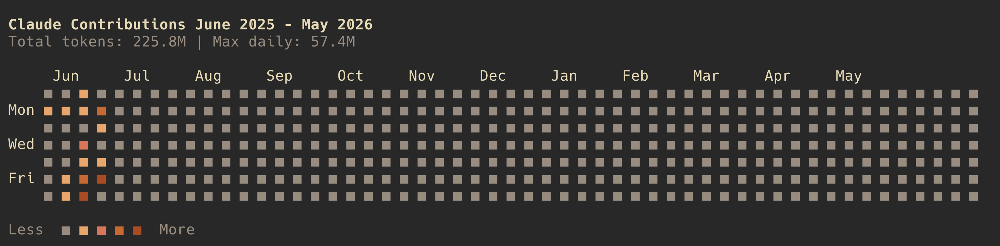

# Claude Contribs

A CLI tool that generates GitHub-style contribution maps for your Claude AI usage, inspired by [ccusage](https://github.com/ryoppippi/ccusage).



## Features

- 📊 **Visual Contribution Maps**: GitHub-style contribution grids showing your Claude usage patterns
- 📈 **Usage Statistics**: Detailed breakdowns of token consumption, costs, and model usage
- 🎨 **Multiple Formats**: Terminal display with colors or SVG export
- 📅 **Flexible Date Ranges**: View specific years or date ranges
- 🔍 **Automatic Data Discovery**: Reads Claude Code JSONL files automatically

## Installation

```bash
npm install -g claude-contribs
```

## Usage

### Show Contribution Map

```bash
# Show current year contribution map
claude-contribs show

# Show specific year
claude-contribs show --year 2024

# Export as SVG
claude-contribs show --format svg

# Use custom data directory
claude-contribs show --data-dir /path/to/claude/data
```

### View Statistics

```bash
# Show all-time statistics
claude-contribs stats

# Show statistics for date range
claude-contribs stats --from 2024-01-01 --to 2024-12-31
```

## Data Source

This tool reads Claude Code JSONL files from:

- Default: `~/.claude/projects/`
- Custom: Use `--data-dir` option

The tool reads Claude Code JSONL files automatically and processes assistant messages with usage data. Example entry format:

```json
{
  "type": "assistant",
  "timestamp": "2025-06-27T10:30:00Z",
  "message": {
    "id": "msg_123",
    "model": "claude-sonnet-4-20250514",
    "usage": {
      "input_tokens": 100,
      "output_tokens": 50,
      "cache_creation_input_tokens": 0,
      "cache_read_input_tokens": 25
    }
  },
  "requestId": "req_456",
  "sessionId": "session_789"
}
```

## Commands

- `claude-contribs show` - Display contribution map (default command)
- `claude-contribs stats` - Show usage statistics
